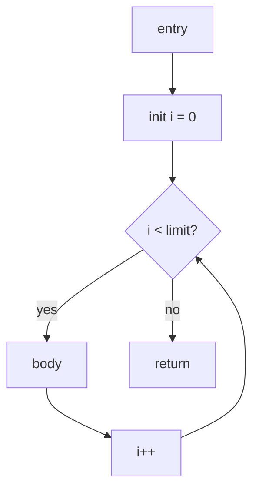

# Understanding How Decompilers Work: A Deep Dive
Decompilers attempt to recover high-level source code from compiled machine code.
They sit one step above disassemblers on the reverse-engineering ladder: where a disassembler turns bytes into assembly, a decompiler tries to rebuild loops, variables, function calls, and data types that resemble C, C++, or another source language.

For retro game research, decompilers are how you turn an opaque ROM or executable into something you can read, annotate, and compare against leaked source or SDK headers.
The output is almost never identical to the original source, but it can be close enough to follow game logic, identify rendering paths, or bootstrap a full matching decompilation project.

This post explains the decompilation pipeline, the main analysis stages, and why some binaries decompile cleanly while others stay stubbornly unreadable.

For the disassembly stage that decompilers depend on, see:


---
## Glossary of Key Terms
If you are new to decompiler terminology, this quick glossary should help:

* <a id="glossary-ast"></a>**AST** - Abstract Syntax Tree; a tree-shaped representation of high-level code structure used when emitting readable output.
* <a id="glossary-cfg"></a>**CFG** - Control Flow Graph; a graph of basic blocks connected by branches, calls, and returns.
* <a id="glossary-ir"></a>**IR** - Intermediate Representation; an architecture-neutral instruction form used between lifting and code generation.
* <a id="glossary-lifting"></a>**Lifting** - Converting native machine instructions into a higher-level IR instead of leaving them as raw assembly mnemonics.
* <a id="glossary-pcode"></a>**P-code** - Ghidra's name for its stack-based intermediate representation used by the decompiler engine [^1].
* <a id="glossary-ssa"></a>**SSA** - Static Single Assignment form; an IR where each virtual variable is assigned exactly once, which simplifies data-flow reasoning [^2].
* <a id="glossary-pseudocode"></a>**Pseudo-code** - Human-readable C-like output produced by a decompiler; useful for analysis but not guaranteed to recompile.

---
## What is a Decompiler?
A decompiler is a program that takes compiled machine code and produces a higher-level representation such as pseudo-C, C#, or Java.
It does not run the program.
It analyzes the binary statically, similar to an advanced disassembler, then applies additional stages that recover structure and data flow.

## Decompilers vs Disassemblers
Disassemblers and decompilers share the same starting point but stop at different levels of abstraction:

Disassembler output (assembly):
```nasm
mov eax, [ebp-0x4]
add eax, 0x1
mov [ebp-0x4], eax
cmp eax, 0xA
jl 0x401020
```

Decompiler output (pseudo-C):
```c
local_4 = local_4 + 1;
if (local_4 < 10) {
    goto LAB_401020;
}
```

The decompiler inferred a local variable, an addition, and a conditional branch.
It may still use awkward names like `local_4` or `LAB_401020` when type and symbol information is missing.

## Decompilers vs Decompilation Projects
The word "decompilation" is used in two related ways:

* **Interactive decompiler tools** - Ghidra, Hex-Rays, Binary Ninja, and similar tools that produce on-demand pseudo-code for one function at a time.
* **Matching decompilation projects** - Community efforts to rewrite an entire game in C or C++ so it compiles back to the original ROM or executable, such as the [Super Mario 64](/super-mario-64) project.

Tool decompilers help you understand code quickly.
Matching projects require human judgment, original compiler research, and years of verification.
The pipeline concepts in this post apply to both, but only the tool path is automatic.

---
# Why Decompilation is Hard
Decompilation is the inverse of compilation, and compilation deliberately destroys information [^3].
A compiler removes variable names, merges statements, inlines functions, reorders instructions, and picks register and stack layouts that never appeared in the source file.
A decompiler must guess all of that back from whatever patterns remain.

## Lost Source-Level Intent
The following information is usually gone from a release binary:

* **Local and global variable names** - Replaced by stack slots and addresses.
* **Type information** - `struct`, `enum`, and pointer types collapse into raw memory accesses.
* **Comments and file boundaries** - Stripped entirely.
* **High-level control structures** - Compiled into jumps and labels.
* **Macro expansions and templates** - Expanded and specialized before machine code exists.

Decompilers recover approximations using data-flow analysis, heuristics, and user annotations.

## Optimizing Compilers
Modern and even many retro compilers apply optimizations that make recovery harder:

* **Instruction scheduling** - Independent operations are reordered for speed.
* **Strength reduction** - Multiplies become shifts or lea-style address math.
* **Inlining** - Function boundaries disappear inside callers.
* **Tail-call optimization** - A call plus return becomes a single jump.
* **Dead store elimination** - Temporary values vanish before memory is touched.

A decompiler may merge what was two source statements or split what was one expression.

## Custom or Hand-Tuned Code
Game code often breaks the patterns decompilers expect:

* **Hand-written assembly** for inner loops, GPU command submission, or audio mixing.
* **Custom calling conventions** in early console SDKs.
* **Self-modifying code** on very old platforms.
* **Overlay or bank-switched memory** where the same address means different code at different times.

In those cases, pseudo-code may be wrong until a human marks memory regions, defines structs, or fixes control flow manually.

---
# The Decompilation Pipeline
Most production decompilers follow the same broad pipeline, even when internal names differ.
[Ghidra](https://ghidra-sre.org/) uses **P-code** lifting into SSA before emitting C [^1].
[RetDec](https://github.com/avast/retdec) lifts to an LLVM-style IR [^4].
[Hex-Rays](https://hex-rays.com/decompiler/) builds an internal microcode layer before its AST-based C output [^5].
The stages below describe the common logic.

---
## Step 1 - Load and Disassemble
Every decompiler starts with the same binary-loading and disassembly work described in the disassemblers post.
It must:

* Parse executable headers and segment layout.
* Identify code vs data regions.
* Decode instructions for the target ISA.
* Recover function entry points from symbols, exports, or heuristics.

If disassembly is wrong at this stage, every later stage inherits the mistake.
Interactive tools let you mark misclassified bytes as code or data before decompiling.

---
## Step 2 - Build a Control Flow Graph
The decompiler groups instructions into **basic blocks**: straight-line sequences that only enter at the top and exit at the bottom through one branch or fall-through [^2].
Blocks become nodes; jumps, calls, and returns become edges in a <a href="#glossary-cfg">CFG</a>.

CFG recovery matters because assembly rarely labels `if`, `while`, or `switch`.
It exposes:

* **Conditional branches** - Candidate `if` and loop headers.
* **Back edges** - Often indicate `while`, `do/while`, or `for` loops.
* **Indirect jumps** - Common in jump tables generated for `switch` statements.

A simplified CFG for a function with a loop might look like this:



---
## Step 3 - Lift to Intermediate Representation
**Lifting** converts architecture-specific instructions into an <a href="#glossary-ir">IR</a> with explicit operations such as load, store, add, compare, and branch [^3].
This step decouples "what the CPU did" from "what the source probably meant."

Example x86 assembly:
```nasm
mov eax, [ebp-0x8]
add eax, ebx
mov [ebp-0x8], eax
```

Lifted IR (conceptual):
```
t0 = load stack[-8]
t1 = add t0, ebx
store stack[-8], t1
```

Once in IR, the same structure-recovery and type-inference passes can target MIPS, PowerPC, SH-4, or x86 without duplicating all logic per architecture.

---
## Step 4 - Convert to SSA Form
Most modern decompilers convert the IR into <a href="#glossary-ssa">SSA</a> form [^2].
In SSA, each assigned value gets a unique name, and merge points use special **phi** nodes to select the correct incoming value.

Why SSA helps:

* **Data-flow questions become local** - "Where does this variable get its value?" is explicit in the graph.
* **Dead code is easier to remove** - Unused SSA names drop out cleanly.
* **Expression trees rebuild cleanly** - Chains of add/shift/load operations map back to one source expression.

Without SSA, recovering expressions from register shuffling and reused stack slots is much harder.

---
## Step 5 - Data-Flow and Type Analysis
After SSA construction, the decompiler analyzes how values move and combine:

* **Reaching definitions** - Which assignments can reach a use site?
* **Use-def chains** - Which consumers depend on a given definition?
* **Constant propagation** - Is a value always the same at a point?
* **Pointer analysis** - Does an add come from struct field access or array indexing?

From these facts the tool guesses types:

* Repeated `+ 4` stride often means a 32-bit array or pointer increment.
* Loads at fixed offsets from the same base often mean a struct field.
* Compare against small integers may recover `enum` or boolean tests.
* Calls to known library functions can propagate parameter types backward.

Type recovery is heuristic.
Two pointers and one integer can look identical until you name a struct and apply it manually in Ghidra or IDA.

---
## Step 6 - Structure Recovery
Structure recovery turns flat CFG graphs back into readable control flow [^3].
This is where `goto`-heavy IR becomes `if`, `else`, `while`, and `switch`.

Common transformations:

* **If-else discovery** - Match two-way branches with shared merge points.
* **Loop identification** - Detect back edges and induction variables such as `i++`.
* **Switch recovery** - Recognize jump tables and build case labels from entry counts.
* **Early return flattening** - Fold multiple exit blocks into return statements.
* **Goto removal** - Replace unnecessary jumps with structured blocks when safe.

A toy example shows why this stage exists.
Given goto-style IR:

```c
if (x < 0) goto L_fail;
result = x * 2;
goto L_done;
L_fail:
result = 0;
L_done:
return result;
```

Structure recovery emits:

```c
if (x < 0) {
    result = 0;
} else {
    result = x * 2;
}
return result;
```

Real binaries produce far messier graphs, especially with compiler-generated break/continue patterns and optimized min/max sequences.

---
## Step 7 - Emit High-Level Pseudo-Code
The final stage walks the recovered structure and types to build an <a href="#glossary-ast">AST</a>, then pretty-prints C-like <a href="#glossary-pseudocode">pseudo-code</a> [^5].
Names come from:

* **Debug symbols** when present.
* **Import/export tables** for API functions.
* **Demangled C++ names** when RTTI survives.
* **Heuristic defaults** such as `local_8`, `param_1`, and `FUN_80001234`.

Interactive decompilers refresh this view as you rename variables, define structs, and fix signatures.
Your annotations flow back into later decompilation of the same function.

---
# Managed Code vs Native Machine Code
Not all binaries decompile with the same difficulty.
Managed runtimes preserve much more structure than a stripped native executable.

## .NET, Java, and Similar IL Targets
Assemblies for [.NET](/decompiling-playstation-mobile-games) or JVM bytecode retain metadata: class names, method signatures, field types, and often debug symbols.
Tools such as [ILSpy](https://github.com/icsharpcode/ILSpy) or [JADX](/Android) can recover readable C# or Java because the type system survived compilation [^6].
PlayStation Mobile titles are a practical retro example: C# plus Mono often decompile almost completely.

## Native Console and PC Executables
Cartridge ROMs, ELF files, and PE executables for consoles such as [Nintendo 64](/n64), [PlayStation](/ps1), and [Game Boy Advance](/gba) usually ship without rich metadata.
Native decompilers must infer everything from machine instructions and whatever symbols remain.
That is the pipeline described above.

For a platform-specific walkthrough using Ghidra on C++, see:


---
# Special Cases in Retro Game Reversing
Some ecosystems give decompilers extra hooks beyond generic native analysis.

## Delphi Binaries
[Delphi](/delphi) executables often retain class VMTs, RTTI, DFM form resources, and published method names.
Delphi-aware tools can recover forms, buttons, and event handlers even when method bodies stay assembly-heavy.
That is structural recovery backed by metadata, not pure instruction lifting.

## Game Maker and Other Domain-Specific Runtimes
Early [Game Maker](/game-maker) EXE files embedded recognizable resource and script formats.
Dedicated Game Maker decompilers target those formats directly instead of relying on a general-purpose C decompiler.
When a runtime carries its own bytecode or project structure, domain-specific tools usually outperform generic ones.

## Bytecode and Script VMs Inside Games
Many games embed a custom bytecode interpreter for AI, cutscenes, or UI logic.
A general decompiler shows the VM dispatcher in native code, not the script language.
Reverse engineers then build a separate script decompiler once they map the opcode table.
The native pipeline still helps locate that interpreter.

---
# Interactive Decompilers Used in Game RE
These tools embed the pipeline above behind a GUI and scripting API:

* **Ghidra** - Free, multi-arch, collaborative; uses P-code and SSA internally [^1].
* **Hex-Rays Decompiler** - Commercial IDA Pro add-on; widely used for PC and some console binaries [^5].
* **Binary Ninja** - Modern UI with built-in MLIL/HLIL intermediate layers and strong scripting [^7].
* **RetDec** - Open retargetable decompiler useful for batch conversion and integration [^4].
* **Reko** - Open-source multi-arch decompiler aimed at interactive analysis [^8].

For a broader tool list and related workflows, see:


---
# Limits of Automatic Decompilation
Perfect source recovery is impossible in the general case [^3].
Multiple different programs can compile to identical machine code, and optimizations erase the original spelling of the source.

Expect these limits in practice:

* **Wrong or generic types** until you apply structs from headers or debug builds.
* **Missing inline functions** merged into callers.
* **Flat or goto-heavy output** on functions with unusual control flow.
* **Incorrect calling conventions** on old or custom ABIs until manually fixed.
* **No comments, asserts, or preprocessor context**.

Treat decompiler output as an editable hypothesis.
Matching decompilation projects succeed because humans iteratively rename, split, and rewrite code until it assembles to the same bytes as the retail ROM [^9].

For a catalog of game projects taking that approach, see:


---
# Getting Started
If you want to experiment with decompilation on a retro binary:

* Pick a small function with clear compiler-generated patterns first, such as math helpers or init code.
* Load the ROM or executable in Ghidra, let analysis finish, then open the decompiler window on one function.
* Compare disassembly and pseudo-code side by side until the mapping clicks.
* Rename one variable and one function, define a struct for a repeated memory access pattern, and re-decompile.
* Read the disassemblers post first if CFG or basic-block terminology is unfamiliar.

Decompilers reward patience and annotation.
The first output is a sketch; the useful map is the one you refine.

---
# References
[^1]: National Security Agency, "Ghidra Software Reverse Engineering Framework," [https://ghidra-sre.org/](https://ghidra-sre.org/).
[^2]: Cytron, Ferrante, Rosen, Wegman, and Zadeck, "Efficiently Computing Static Single Assignment Form and the Control Dependence Graph," *ACM Transactions on Programming Languages and Systems*, 1991, [https://doi.org/10.1145/115372.115320](https://doi.org/10.1145/115372.115320).
[^3]: Cifuentes, *Reverse Compilation Techniques*, PhD thesis, Queensland University of Technology, 1994, [https://www.library.qut.edu.au/documents/10909/7092644/7092644.pdf](https://www.library.qut.edu.au/documents/10909/7092644/7092644.pdf).
[^4]: Avast, "RetDec: Retargetable Machine-Code Decompiler," [https://github.com/avast/retdec](https://github.com/avast/retdec).
[^5]: Hex-Rays, "Hex-Rays Decompiler," [https://hex-rays.com/decompiler/](https://hex-rays.com/decompiler/).
[^6]: ECMA International, "ECMA-335: Common Language Infrastructure (CLI)," [https://www.ecma-international.org/publications-and-standards/standards/ecma-335/](https://www.ecma-international.org/publications-and-standards/standards/ecma-335/).
[^7]: Vector 35, "Binary Ninja Documentation," [https://docs.binary.ninja/](https://docs.binary.ninja/).
[^8]: Reko Decompiler Project, [https://github.com/uxmal/reko](https://github.com/uxmal/reko).
[^9]: decomp.me community wiki, "Matching Decompilation," [https://decomp.me/](https://decomp.me/).
