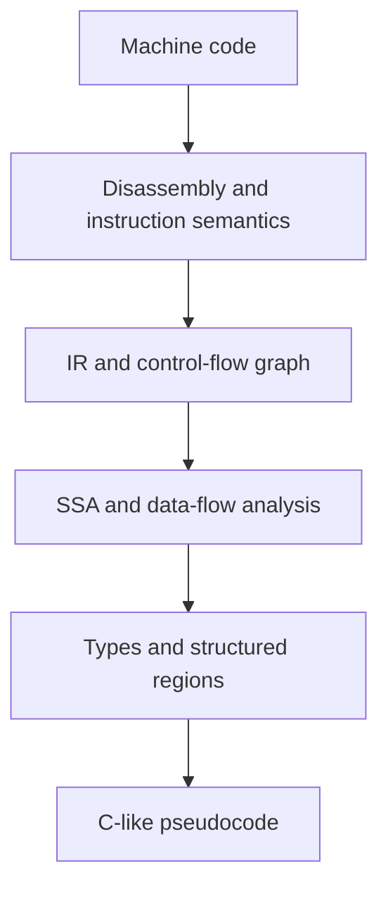
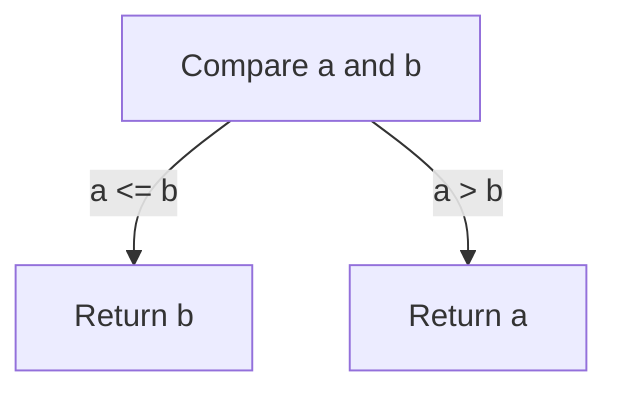

A decompiler is not an assembly-to-C dictionary.
It is a program-analysis engine that recovers a plausible high-level program from machine-code behaviour.

This tutorial follows one small function through the main representations used by modern decompilers.
Expandable questions appear before each important idea.
Choose an answer before opening the explanation.

# The Result Is a Reconstruction
A disassembler decodes machine instructions into assembly language.
A decompiler goes further by recovering expressions, logical variables, types, and structured control flow.

Compilation usually discards source-level details such as comments, formatting, and many local names.
Optimization can also merge, split, reorder, or remove source operations.
The result is therefore C-like pseudocode with equivalent intended behaviour, not a guaranteed copy of the original source.

<details markdown="1">
<summary>Question: What is the main difference between a disassembler and a decompiler?</summary>

A disassembler exposes instructions and operands.
A decompiler analyses those instructions together and proposes higher-level constructs such as variables, expressions, calls, `if` statements, loops, and structures.

</details>

The conceptual pipeline looks like this:



Real implementations may build and refine these representations in a different order.
The diagram describes dependencies, not a mandatory pass schedule.

---
# Glossary of Key Terms
The same terms recur throughout the tutorial:
* <a id="glossary-ir"></a>**IR** - Intermediate representation that gives machine operations architecture-independent semantics.
* <a id="glossary-cfg"></a>**CFG** - Control-flow graph whose nodes are basic blocks and whose edges are possible transfers of execution.
* <a id="glossary-ssa"></a>**SSA** - Static single assignment form, where each value definition receives a distinct name.
* <a id="glossary-phi"></a>**Phi node** - An SSA merge that selects the value associated with the predecessor block that executed.
* <a id="glossary-basic-block"></a>**Basic block** - A maximal straight-line sequence with one entry and no internal branch target or control-flow split.
* <a id="glossary-dominator"></a>**Dominator** - A mandatory checkpoint on every path from the function entry to another block.
* <a id="glossary-back-edge"></a>**Back edge** - An edge from a loop latch to a header that dominates the latch.
* <a id="glossary-abi"></a>**ABI** - Application binary interface that defines details such as parameter passing, return values, and register preservation.
* <a id="glossary-fixed-point"></a>**Fixed point** - The state reached when another analysis iteration produces no new facts.

---
# Recovering a Small Function
Consider this x86-64 assembly in Intel syntax:

```nasm
cmp edi, esi
jle .use_b
mov eax, edi
ret

.use_b:
mov eax, esi
ret
```

Under the System V AMD64 [ABI](#glossary-abi), `edi` and `esi` carry the first two integer arguments and `eax` carries an integer return value [^1].
`cmp edi, esi` prepares flags for the comparison, and `jle` takes the branch when the first value is less than or equal to the second [^2].

<details markdown="1">
<summary>Question: What high-level control-flow structure is present?</summary>

There is a conditional choice between two return values.
A first reconstruction could be:

```c
if (a <= b) {
    return b;
}

return a;
```

An expression simplifier may later emit:

```c
return a > b ? a : b;
```

Both forms describe the same behaviour for this example.

</details>

The decompiler had to use several facts together:
* **Instruction semantics** - `cmp` and `jle` define a conditional transfer.
* **Calling convention** - `edi`, `esi`, and `eax` have argument and return roles.
* **Control flow** - Each branch assigns the return value and exits.
* **Expression recovery** - The two branches can be presented as an `if` or conditional expression.

---
# Logical Variables and Physical Storage
A logical variable is a value in the recovered program.
A physical location is where that value happens to live at one moment, such as a register or stack slot.

One logical variable may move through several locations.
One register may also hold several unrelated values at different times.
Optimized code can split one source variable into independent values or combine several source expressions into one machine value.

<details markdown="1">
<summary>Question: Why can the decompiler not keep names such as edi and esi and stop there?</summary>

Register names describe storage, not programmer intent.
Keeping them would hide argument roles, value lifetimes, and movement between registers and memory.

The decompiler instead creates logical values such as `arg1`, `arg2`, and `result`.
Names such as `width` or `playerCount` still require symbols or human interpretation.

</details>

This distinction explains why recovered pseudocode can look stable even when different compilers allocate different registers.

---
# Lifting Instructions into IR
[Ghidra](/ghidra) uses SLEIGH descriptions to translate processor instructions into p-code.
P-code records instruction semantics in a processor-neutral form and provides a common basis for data-flow analysis [^3].

A machine instruction may expand into several [IR](#glossary-ir) operations.
For example, a processor comparison may become arithmetic on temporary values plus explicit condition flags.
The analysis no longer needs a separate implementation for every spelling of every processor instruction.

<details markdown="1">
<summary>Question: Is IR used to abstract registers, and SSA used to track data flow?</summary>

That is a useful first model, with one refinement.

IR describes what operations mean and can still contain register-like storage locations.
[SSA](#glossary-ssa) then gives each definition a unique identity so def-use relationships become explicit.
The CFG supplies the paths along which those values can travel.

</details>

IR is not automatically lossless.
A binary lifter must preserve flags, partial registers, memory effects, instruction addresses, and other details needed by later analysis.
Decompiler-specific IRs are designed around these requirements.

---
# Building the Control-Flow Graph
A [CFG](#glossary-cfg) records the possible order of execution.
Each node is normally a [basic block](#glossary-basic-block), and each directed edge represents a possible next block.

A new block begins at the function entry, at a branch target, or after an instruction that can transfer control elsewhere.
The current block ends immediately before that boundary.

<details markdown="1">
<summary>Question: Does every basic block end with a jump, call, or return?</summary>

Every basic block ends at a control-flow boundary, but a `call` is not normally a within-function terminator.
An ordinary call returns to the following instruction, so that instruction can remain in the same block.

Branches, returns, traps, and indirect transfers commonly terminate blocks.
A block may also end in fallthrough because the next instruction is a branch target and must begin another block.

</details>

For the small maximum function, the graph has a comparison block and two return blocks:



<details markdown="1">
<summary>Question: Must the IR be built before the CFG, or the CFG before the IR?</summary>

There is no universal one-pass order.
A decompiler can decode and lift instructions while discovering block boundaries, then refine both the IR and CFG as indirect targets and function boundaries become clearer.

Complete SSA construction depends on a CFG because merge placement uses predecessor and dominance information.
Initial IR lifting does not need complete SSA.

</details>

---
# Converting Values to SSA
In [SSA](#glossary-ssa), each definition gets a unique name:

```text
x1 = 4
x2 = x1 + 1
x3 = x2 * 2
```

The name identifies a definition, not a mutable storage cell.
Uses of `x3` can point directly to the multiplication that defined it.

<details markdown="1">
<summary>Question: Do you still need to inspect x2 and x1 to know the final value?</summary>

Yes, if the goal is to evaluate the complete expression.
The benefit is that each use has one direct definition.

Without SSA, an analyst may need to scan many instructions and consider every possible overwrite of `x`.
With SSA, the def-use chain tells the analysis exactly which earlier values matter.

</details>

SSA is a representation, not a data-flow algorithm.
Analyses such as constant propagation, dead-code elimination, liveness, range analysis, and type propagation can operate on SSA or other representations.
SSA makes many of them simpler because definitions and uses are explicit.

---
## Merging Branch Values with Phi Nodes
A [phi node](#glossary-phi) represents a value at a block with multiple predecessors.
It has one incoming value and predecessor pair for each relevant incoming edge [^4].

```text
entry:
    if condition goto left else right

left:
    x1 = 10
    goto join

right:
    x2 = 20
    goto join

join:
    x3 = phi(x1 from left, x2 from right)
```

The phi node is not an ordinary runtime function call.
It means that `x3` takes the value associated with the edge used to enter `join`.

<details markdown="1">
<summary>Question: Why is it called phi, and can it have more than two values?</summary>

The original SSA literature used the name and notation `phi` for merge functions [^5].
The name remains even when IR is written with ASCII text.

A phi node can have more than two inputs.
A join after a `switch`, for example, can have one pair for every predecessor block.

</details>

<details markdown="1">
<summary>Question: What happens when a branch does not change the value?</summary>

If every incoming edge supplies the same value, the phi is redundant:

```text
x3 = phi(x1 from left, x1 from right)
```

Copy propagation and simplification can replace `x3` with `x1`.
Decompilers repeatedly remove this kind of analysis artifact before emitting pseudocode.

</details>

---
# Finding Loops with Dominance
Block `A` [dominates](#glossary-dominator) block `B` when every path from the function entry to `B` passes through `A`.
Every reachable block dominates itself because every path that reaches that block includes the block.
This reflexive definition also keeps dominance algorithms consistent.

A natural loop contains a header that dominates its blocks.
An edge from a loop latch to that header is a [back edge](#glossary-back-edge) [^6].

<details markdown="1">
<summary>Question: Is an edge a back edge merely because it points upward in a diagram?</summary>

No.
For the natural-loop definition, the destination must dominate the source.

An edge to an earlier-looking block that does not dominate its source may be classified as a retreating, cross, or other edge depending on the graph traversal and terminology.
Its visual direction is not enough.

</details>

Consider this source loop:

```c
int i = 0;

while (i < 10) {
    i++;
}
```

Its loop header needs values from two paths:

```text
i1 = 0

header:
    i2 = phi(i1 from entry, i3 from latch)
    if i2 >= 10 goto exit

latch:
    i3 = i2 + 1
    goto header
```

<details markdown="1">
<summary>Question: Which definitions feed the loop phi node?</summary>

The first input is the initial value from before the loop.
The second input is the incremented value from the previous iteration.

Every variable updated in the loop and used on a later iteration may need a similar phi node at the appropriate header.

</details>

---
# Recovering If Statements, Loops, and Switches
Processors execute comparisons and transfers.
They do not execute source-level keywords such as `if`, `while`, or `switch`.

Control-flow structuring groups CFG regions into higher-level constructs.
A branch whose paths rejoin without a cycle is an acyclic conditional region.
A region containing an appropriate back edge is a loop candidate.
A multi-way branch may become a `switch`.

<details markdown="1">
<summary>Question: What does acyclic mean?</summary>

A directed graph is acyclic when no path can follow directed edges and return to its starting node.

An ordinary `if/else` diamond is acyclic.
A loop necessarily introduces a cycle.

</details>

Region formation is recursive.
An `if` may contain a loop, and that loop may contain another conditional or switch.
The decompiler forms inner regions and combines them into larger structured regions.

<details markdown="1">
<summary>Question: Can every CFG be represented cleanly with only if, while, and switch?</summary>

Not without transformations.
Arbitrary jumps can create irreducible control flow with no single header dominating a cycle.

A decompiler may emit `goto`, duplicate code, or apply semantics-preserving graph transformations.
Different valid structuring algorithms can therefore produce different pseudocode for the same machine behaviour [^7].

</details>

---
# Inferring Types from Use
Machine memory is not intrinsically a C structure, array, or object.
Instructions provide evidence about width, interpretation, and access patterns.

The following examples show evidence rather than proof:

```nasm
mov eax, [rdi + 8]
```

This is a 4-byte load from an address at offset 8.
It suggests that `rdi` is pointer-like and that something 4 bytes wide is used at offset 8.
Repeated fixed-offset accesses can support a structure hypothesis.

```nasm
mov eax, [rdi + rsi*4]
```

The base-plus-index-times-four pattern suggests an array of 4-byte elements.
Later use determines whether an element is an integer, float bit pattern, pointer fragment, or another type.

```nasm
mov rax, [rdi + rsi*8]
mov ecx, [rax + 4]
```

The first load obtains an 8-byte array element.
The second instruction treats that element as an address and loads 4 bytes at offset 4.
On x86-64 this is strong evidence for an array of pointers to objects with a field at offset 4.

---
## Instruction Classes Add Type Evidence
This instruction moves a scalar single-precision floating-point value between memory and an XMM register [^2]:

```nasm
movss xmm0, [rdi]
```

It is stronger float evidence than a general-purpose 32-bit load.

This instruction loads one byte and zero-extends it [^2]:

```nasm
movzx eax, byte [rdi + 3]
```

Possible source types include `unsigned char`, `bool`, a small enum, or a flag byte.
If later code only tests zero versus non-zero, the flag or boolean interpretation becomes stronger.

<details markdown="1">
<summary>Question: Does a 32-bit load prove that the value is an int?</summary>

No.
It proves the width of the access and the immediate operation performed on the bits.

The same 32 bits could represent an integer, float, pointer fragment, characters, flags, or raw data.
The decompiler combines instruction class, later uses, function signatures, neighbouring accesses, and user-supplied types.

</details>

Known library signatures are especially useful.
If a value is passed as the first parameter to `strlen`, the known prototype supplies evidence that the value is a `char *`.
An unknown function named `FUN_00102030` provides far less evidence until its own callers and body are analysed.

---
# Refining Facts Until a Fixed Point
Decompiler analysis is normally iterative.
IR values can begin with a width and unknown high-level type, then gain facts as other passes run.

A typical feedback cycle contains these steps:
* **Type propagation** - Transfer type evidence through assignments, operations, calls, and phi nodes.
* **Constant propagation** - Replace values whose definitions prove a constant result.
* **Expression simplification** - Fold identities and remove redundant temporaries.
* **Dead-code elimination** - Remove definitions with no observable effect.
* **Structure recovery** - Use the cleaner graph and expressions to recognise higher-level regions.

The passes repeat until they reach a [fixed point](#glossary-fixed-point), or until an implementation-specific limit is reached.

<details markdown="1">
<summary>Question: Is SSA created in one pass and typed in a second pass?</summary>

That is one possible implementation outline, but it is not a universal rule.

Instruction semantics already provide widths and some type clues during lifting.
SSA construction makes value flow explicit.
Later analyses attach and refine stronger type information, and discoveries can trigger more simplification or propagation.

</details>

When all incoming phi values agree on a type, that type can propagate to the result.
When they disagree, the decompiler may choose an unknown or wider type, insert a cast, infer a union-like use, or revisit earlier assumptions.

---
# Why Compilers and Decompilers Look Similar
Compilers and decompilers both use IR, CFGs, SSA, constant propagation, dead-code elimination, and other graph analyses.
The direction and available evidence differ.

The comparison is:

Compiler | Decompiler
---|---
Starts with source syntax and declared types | Starts with machine semantics and partial metadata
Lowers high-level operations | Recovers high-level operations
Chooses physical registers | Recovers logical values from physical storage
Preserves or removes source information deliberately | Infers information that may no longer exist
Emits machine code | Emits C-like pseudocode

<details markdown="1">
<summary>Question: If LLVM already has IR, SSA, and optimisation passes, why not use it for every decompiler?</summary>

LLVM IR can be useful for binary lifting and recompilation.
It is not automatically a faithful machine-code model.

A lifter must model flags, partial registers, exact wrapping behaviour, unusual memory effects, and instruction provenance.
It must also avoid introducing LLVM undefined or poison behaviour where the original CPU instruction had defined semantics [^8].

Decompiler-specific IRs such as Ghidra p-code are designed to preserve machine-level evidence needed for reverse engineering.
Using LLVM is an engineering trade-off, not a mistake or an automatic solution.

</details>

---
# Final Reconstruction Challenge
Use the concepts above to explain this simplified flow before revealing the answer:

```text
entry:
    total1 = 0
    i1 = 0
    goto header

header:
    total2 = phi(total1 from entry, total3 from body)
    i2 = phi(i1 from entry, i3 from body)
    if i2 >= count goto exit

body:
    value = load32(base + i2 * 4)
    total3 = total2 + value
    i3 = i2 + 1
    goto header

exit:
    return total2
```

<details markdown="1">
<summary>Reveal the reconstructed source and the evidence</summary>

A plausible reconstruction is:

```c
int total = 0;

for (int i = 0; i < count; i++) {
    total += base[i];
}

return total;
```

The evidence is:
* **CFG** - The edge from `body` to the dominating `header` identifies a natural loop.
* **SSA** - The two phi nodes merge initial values with values from the previous iteration.
* **Addressing** - `base + i2 * 4` suggests indexing 4-byte elements.
* **Data flow** - `total3` accumulates each loaded value, while `i3` advances the index.
* **Structuring** - The initialisation, header test, body, and increment fit a `for` loop, although a `while` loop would also be valid pseudocode.

</details>

---
# The Working Mental Model
A useful summary separates the main representations:

Representation | Question it answers
---|---
Disassembly | Which machine instructions were encoded?
IR | What do those instructions do?
CFG | Where can execution go next?
SSA | Which definition reaches each use?
Data-flow facts | What constants, ranges, types, and effects can be proved?
Structured regions | Which high-level control constructs plausibly describe the graph?
Pseudocode | How can the recovered behaviour be presented to a human?

A modern decompiler is therefore an iterative graph-analysis system.
It lifts machine semantics, recovers control and value flow, accumulates evidence, and finally prints one readable high-level explanation of the binary.

For a practical next step, use the existing Ghidra tutorial to apply these ideas to a compiled C++ program:



---
# References
[^1]: [System V Application Binary Interface AMD64 Architecture Processor Supplement](https://refspecs.linuxbase.org/elf/x86_64-abi-0.99.pdf)
[^2]: [Intel 64 and IA-32 Architectures Software Developer Manuals](https://www.intel.com/content/www/us/en/developer/articles/technical/intel-sdm.html)
[^3]: [Ghidra SLEIGH and p-code documentation](https://ghidra.re/ghidra_docs/languages/html/sleigh.html)
[^4]: [LLVM Language Reference Manual - phi instruction](https://llvm.org/docs/LangRef.html#phi-instruction)
[^5]: [Cytron et al. An Efficient Method of Computing Static Single Assignment Form](https://doi.org/10.1145/75277.75280)
[^6]: [LLVM Loop Terminology and Canonical Forms](https://llvm.org/docs/LoopTerminology.html)
[^7]: [Yakdan et al. No More Gotos](https://www.ndss-symposium.org/ndss2015/ndss-2015-programme/no-more-gotos-decompilation-using-pattern-independent-control-flow-structuring-and-semantics/)
[^8]: [LLVM IR Undefined Behavior Manual](https://llvm.org/docs/UndefinedBehavior.html)
