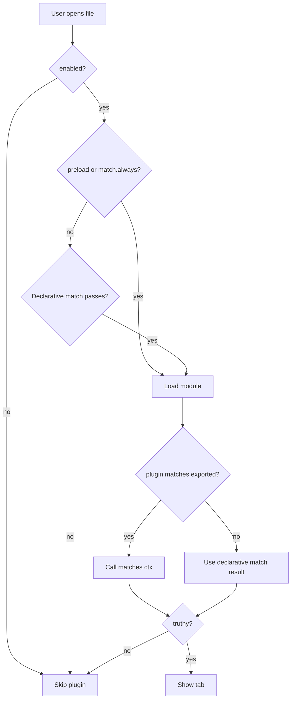

# File Lab Plugin API

This guide covers everything needed to build a File Lab plugin, publish it to a CDN such as [unpkg](https://unpkg.com), and let users install it from the File Lab modal itself.

File Lab plugins are ES modules. Each plugin renders a tab when a user opens a matching file. Built-in plugins ship with the site in `plugins.json`; third-party plugins ship a standalone `file-lab-plugin.json` manifest that users paste into File Lab's install field.

The File Lab UI opens as an in-page modal from the site navbar (and also as a full page at `/file-lab/`). Cross-origin isolation for SharedArrayBuffer / WASM tools is provided by a root-scoped COI service worker, which is required because the modal runs in the top-level site document. Plugin authors do not need to handle isolation.

---

## How plugin matching works

Matching happens in two phases. Phase 1 is a cheap JSON pre-filter that runs before the plugin module is downloaded. Phase 2 is an optional runtime check inside your module after it loads.



### Phase 1: declarative `match` rules

Defined in your manifest (`match` object). Evaluated against a **file context** without importing your module:

| Rule | Type | Description |
|------|------|-------------|
| `always` | `boolean` | If `true`, the plugin is considered for every file. |
| `extensions` | `string[]` | File extensions, with or without a leading dot (e.g. `".gb"` or `"gb"`). |
| `minSize` | `number` | Minimum file size in bytes. |
| `maxSize` | `number` | Maximum file size in bytes. |
| `filenameIncludes` | `string[]` | Case-insensitive substring match against `path` or `filename`. |
| `magic` | `array` | Byte patterns that must match at given offsets (see below). |

**Important:** If `match` is omitted or empty, File Lab treats the plugin as eligible for every file (the module is loaded and evaluated for all opens). If `match` is present, at least one rule must be satisfied. An empty object `{}` never matches in phase 1.

Magic bytes accept two forms:

```json
{ "offset": 260, "bytes": ["CE", "ED", "66", "66"] }
```

or shorthand `[offset, "CE", "ED", ...]`. Hex values may include a `0x` prefix.

Plugins with `preload: true` or `match.always: true` load at File Lab startup. Other plugins load lazily when a file passes the declarative pre-filter.

### Phase 2: runtime `matches(ctx)`

After your module loads, File Lab calls `matches(ctx)` if you export it. Return a boolean or a Promise that resolves to boolean.

Use phase 1 for cheap checks (extension, size, header bytes). Use phase 2 for logic that is awkward to express in JSON or needs full file inspection.

If you omit `matches()`, File Lab falls back to the phase 1 result.

**Example:** The built-in Game Boy emulator plugin uses both:

* Manifest: `.gb`/`.gbc`, `minSize: 32768`, Nintendo logo bytes at offset 260.
* Module: `matches(ctx)` re-validates the header in JavaScript.

Always-on viewers (Hex, Strings) set `match.always: true` and export `matches() { return true; }`.

---

## File context (`ctx`)

Every lifecycle hook receives a context object for the currently selected file:

```typescript
interface FileContext {
  filename: string;   // basename, e.g. "game.gb"
  path: string;       // tree path, e.g. "roms/game.gb"
  bytes: Uint8Array;  // full file contents
  size: number;       // byte length
}
```

The entire file is in memory. Avoid copying `bytes` unless necessary.

---

## Manifest schema (`file-lab-plugin.json`)

Publish this file at a stable URL. Users install plugins by pasting that URL into File Lab.

```json
{
  "id": "my-plugin",
  "title": "My Plugin",
  "module": "./index.js",
  "base": "https://unpkg.com/my-file-lab-plugin@1.0.0/dist/",
  "css": "plugin.css",
  "wasm": "core.wasm",
  "preload": false,
  "enabled": true,
  "order": 100,
  "match": {
    "extensions": [".nes"],
    "minSize": 16384,
    "magic": [{ "offset": 0, "bytes": ["4E", "45", "53", "1A"] }]
  }
}
```

| Field | Required | Description |
|-------|----------|-------------|
| `id` | yes | Stable unique identifier. Use kebab-case. |
| `title` | no | Tab label. Defaults to `id`. |
| `module` | yes | ES module entry URL or path relative to `base`. |
| `base` | no | Directory URL for resolving relative assets. Defaults to the manifest directory. |
| `css` | no | Stylesheet path or absolute URL. Injected once when the plugin first loads. |
| `wasm` | no | WASM binary path or URL. Loaded before `init()`. |
| `preload` | no | Load at File Lab startup instead of on first match. |
| `enabled` | no | Default `true`. Set `false` to ship a disabled stub. |
| `order` | no | Tab sort order (lower = further left). Default `500` for user installs. |
| `match` | no | Declarative matching rules (see above). |

Relative paths in `module`, `css`, and `wasm` resolve against `base`. Absolute `https://` paths are used as-is.

---

## Plugin module API

Default-export an object with these members:

```javascript
export default {
  id: "my-plugin",
  title: "My Plugin",
  order: 100,

  matches(ctx) {
    return ctx.filename.endsWith(".nes");
  },

  async init(host) {
    // Optional. Called once after module (and WASM) load.
  },

  activate(ctx, panel, host) {
    // Required. Render into panel (empty HTMLElement).
  },

  deactivate(panel, host) {
    // Optional. Tear down listeners, virtual scrollers, etc.
  },

  wasmImports: {
    // Optional. Import object passed to WebAssembly.instantiateStreaming.
  }
};
```

| Export | Required | When called |
|--------|----------|-------------|
| `id`, `title`, `order` | recommended | Should mirror the manifest; used for display and sorting. |
| `matches(ctx)` | no | After load, before showing the tab. |
| `init(host)` | no | Once after JS/WASM load. |
| `activate(ctx, panel, host)` | yes | When the user selects your tab. |
| `deactivate(panel, host)` | no | When leaving the tab or closing the file. |
| `wasmImports` | no | WASM import object for your binary. |

`activate` and `deactivate` may return a Promise.

---

## Host object

File Lab passes a **host** as the third argument to `init`, `activate`, and `deactivate`:

```typescript
interface PluginHost {
  config: PluginEntry;           // normalized manifest entry
  baseUrl: string;               // asset base URL
  resolveAsset(path: string): string;
  wasm: WebAssembly.Instance | null;
    api: {
    escapeHtml(text: string): string;
    formatSize(bytes: number): string;
    renderNotice(message: string): string;
    loadWasm(url: string, imports?: object): Promise<WebAssembly.Instance>;
    pushDetailView?(options: { title: string; subtitle?: string; onPop?: () => void }): boolean;
    popDetailView?(): boolean;
    clearDetailViews?(): void;
  };
}
```

Use `host.resolveAsset("./icon.svg")` for sibling assets. Use `host.api.escapeHtml()` when inserting user-controlled text into `innerHTML`.

### Shared plugin state (IndexedDB)

Each file gets a stable `fileKey` (SHA-256 of file bytes) exposed on the file context and host. Plugins can read and write namespaced blobs that other plugins reuse across sessions:

```javascript
// Write after expensive analysis (e.g. radare2 function list)
await host.api.setPluginState({
  version: 1,
  analyzedAt: Date.now(),
  functions: [{ offset: 0x401000, name: "main", size: 128 }]
});

// Read another plugin's data
var r2 = await host.api.getPluginState("r2");
if (r2 && r2.functions) {
  // use accurate function list
}

// Read the full merged record
var shared = await host.api.getSharedState();
```

| Method | Description |
|--------|-------------|
| `host.fileKey` | Content hash for the active file (also on `ctx.fileKey`). |
| `getPluginState(pluginId?)` | Load one plugin's saved blob. Defaults to the calling plugin's id. |
| `setPluginState(data)` | Replace the calling plugin's blob for this file. |
| `getSharedState()` | Load the full `{ version, fileKey, updatedAt, plugins }` record. |

State persists in IndexedDB (`rr-file-lab-plugin-state`) and survives page reloads. The R2 plugin writes `plugins.r2.functions`; Pyre reads it when present instead of heuristic discovery.

### Detail navigation (header back stack)

When a plugin opens a sub-view inside a file (for example a function detail page), it can push frames onto File Lab's detail header stack. The main **Back** button then pops plugin frames first before returning to the file tree.

```javascript
activate(ctx, panel, host) {
  panel.querySelector(".item").addEventListener("click", function () {
    host.api.pushDetailView({
      title: "fcn.00468570",
      subtitle: "0x00468570 · game.exe",
      onPop: function () {
        // Restore the plugin list view when the user clicks Back.
        hideFunctionDetail();
      }
    });
    showFunctionDetail();
  });
}
```

| Method | Description |
|--------|-------------|
| `pushDetailView({ title, subtitle?, onPop? })` | Push a header frame for the active plugin tab. Updates the File Lab back bar title/subtitle. |
| `popDetailView()` | Pop the top frame for this plugin without calling `onPop`. Use when the plugin closes its own sub-view. |
| `clearDetailViews()` | Remove all stacked frames for this plugin. File Lab calls this automatically on tab switch and deactivate. |

When the user clicks **Back** or presses Escape in detail view, File Lab pops the top frame and calls its `onPop` callback. If the stack is empty, **Back** returns to the file tree.

---

## Recommended folder layout

```
my-file-lab-plugin/
  package.json
  file-lab-plugin.json    # install manifest (at package root or dist/)
  dist/
    index.js              # default export
    plugin.css            # optional
    core.wasm             # optional
    helpers.js            # optional extra modules
```

Your entry module may import relative paths inside the same package. unpkg serves npm package files at:

`https://unpkg.com/<package>@<version>/<path>`

Point `file-lab-plugin.json` at `dist/index.js` and set `base` to the `dist/` URL so CSS, WASM, and helper imports resolve correctly.

---

## Styling

* Scope CSS under a plugin-specific class prefix (e.g. `.rr-file-lab-hex-...`).
* Prefer [site CSS variables](https://github.com/mattgodbolt/retroReversing/blob/main/public/css/variables.css) such as `--rr-color-heading`, `--rr-color-meta`, `--rr-color-content-border`, `--rr-color-table-hover`.
* Do not rely on hard-coded light/dark colors; File Lab follows site theme tokens.
* Shared shell styles live in `public/css/file-lab.css`. Plugin-specific styles belong in your plugin's `plugin.css`.

---

## WASM

1. Add `"wasm": "core.wasm"` to the manifest (path relative to `base`).
2. Export `wasmImports` from your module if the binary needs imports.
3. Access the instantiated module via `host.wasm` in `init` and `activate`.

File Lab uses `WebAssembly.instantiateStreaming`. The WASM URL must be served with `application/wasm` (unpkg does this correctly).

---

## Publishing to npm and unpkg

1. Set `"type": "module"` in `package.json` (or use `.mjs` entry files).
2. Include `file-lab-plugin.json`, your JS, CSS, and WASM in the published `"files"` list.
3. Publish to npm.
4. Your install URL becomes:

   `https://unpkg.com/<package>@<version>/file-lab-plugin.json`

Pin the version in documentation so installs stay reproducible.

### CORS and module requirements

* All assets (manifest, JS, CSS, WASM) must be fetchable cross-origin from the RetroReversing site.
* unpkg sets permissive CORS headers by default.
* Self-hosted origins must send `Access-Control-Allow-Origin` (or equivalent) for browser `fetch()` and dynamic `import()`.
* Serve JavaScript as ES modules. Do not assume Node.js built-ins unless you bundle them.

---

## Installing from File Lab

1. Open **File Lab** from the site navbar.
2. Click the gear icon in the header to open **Settings**.
3. Paste the full URL to your `file-lab-plugin.json` into **Install plugin**.
4. Click **Install**.

File Lab fetches the manifest, resolves asset URLs, and stores the entry in `localStorage` (`rr-file-lab-user-plugins`). Installed plugins persist across sessions. Use **Remove** beside an entry to uninstall.

User-installed plugins merge with built-in plugins. Matching `id` replaces the built-in entry for that browser session.

---

## Minimal example

**file-lab-plugin.json**

```json
{
  "id": "hello-header",
  "title": "Header",
  "module": "./index.js",
  "order": 200,
  "match": {
    "minSize": 4
  }
}
```

**index.js**

```javascript
export default {
  id: "hello-header",
  title: "Header",
  order: 200,

  matches(ctx) {
    return ctx.size >= 4;
  },

  activate(ctx, panel, host) {
    var hex = Array.from(ctx.bytes.subarray(0, 4))
      .map(function (b) { return b.toString(16).padStart(2, "0"); })
      .join(" ");

    panel.innerHTML =
      '<div class="rr-file-lab-plugin-placeholder">' +
      "<h3>" + host.api.escapeHtml(ctx.filename) + "</h3>" +
      "<p>First four bytes: <code>" + host.api.escapeHtml(hex) + "</code></p>" +
      "</div>";
  }
};
```

Host at `https://unpkg.com/your-scope/hello-header@1.0.0/file-lab-plugin.json` and install from File Lab.

---

## Virtual scrolling

Large files should not render every row into the DOM. Built-in Hex and Strings plugins use the shared `createVirtualList()` helper from `virtual-scroll.js`. Remote plugins can copy that pattern or implement their own fixed-row-height scroller.

If you attach listeners or scroller instances in `activate`, clean them up in `deactivate`.

---

## Built-in reference plugins

| Plugin | Path | Notes |
|--------|------|-------|
| Hex | `plugins/hex/` | Always-on, virtualized hex dump |
| Strings | `plugins/strings/` | Always-on, sortable string extractor |
| Game Boy emulator | `plugins/gameboy-emulator/` | Extension + magic + runtime `matches()` |

See `plugins.json` for the site registry format (same fields as `file-lab-plugin.json`, wrapped in a `plugins` array).

---

## Checklist

* [ ] Unique `id` in manifest and module export
* [ ] `module` is a valid ES module URL
* [ ] `match` rules are as narrow as practical (avoid loading heavy plugins for every file)
* [ ] `matches(ctx)` agrees with declarative rules when both are used
* [ ] User text escaped via `host.api.escapeHtml()`
* [ ] CSS uses `--rr-color-*` tokens
* [ ] `deactivate` cleans up DOM listeners and scrollers
* [ ] CORS works from `https://www.retroreversing.com` (or your deployment origin)
* [ ] `file-lab-plugin.json` URL is version-pinned on unpkg

---

## Troubleshooting

| Symptom | Likely cause |
|---------|----------------|
| Install fails with fetch error | Bad URL, CORS, or non-JSON response |
| Tab never appears | `match` too strict, `matches()` returns false, or `enabled: false` |
| Tab appears for every file | Empty/missing `match` without a restrictive `matches()` |
| WASM fails to load | Wrong MIME type, CORS, or missing `wasmImports` |
| CSS not applied | Wrong path relative to `base`, or blocked by CSP |
| Module import error | Not ESM, bare specifier without bundling, or wrong unpkg path |

Open the browser developer console while using File Lab; the registry logs load failures with the plugin `id`.
